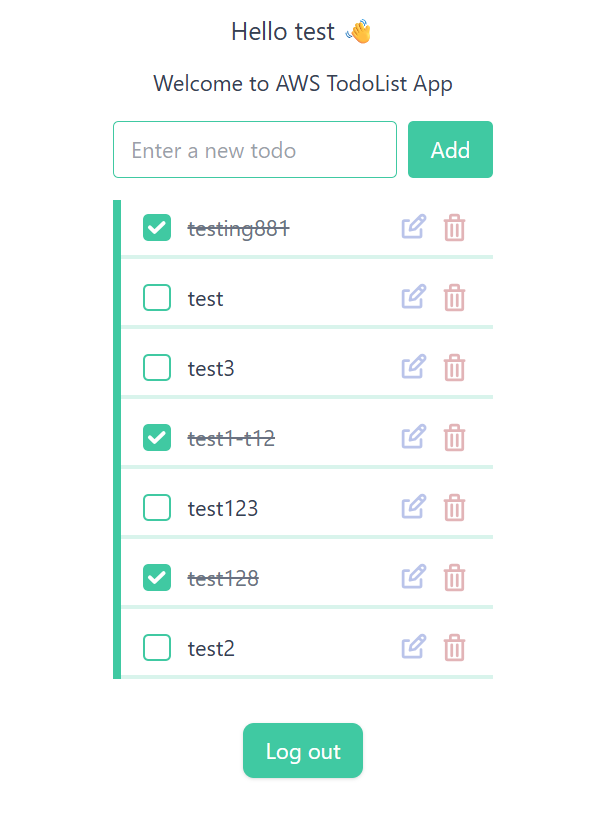
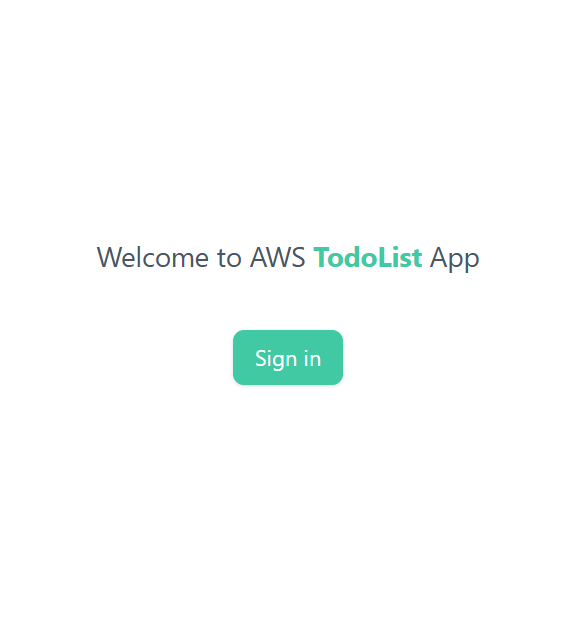
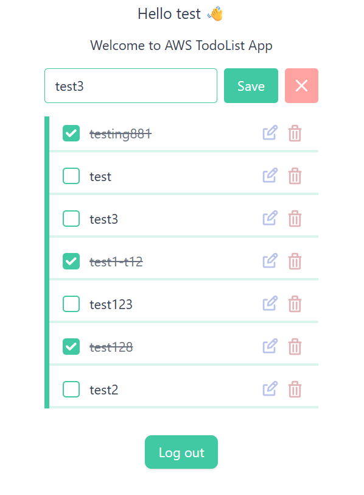

# ✅ Serverless Todo App

A full-stack **To-do List Application** built with **React**, **Tailwind CSS**, **AWS Lambda**, **DynamoDB**, and **Amazon Cognito**. This application supports creating, editing, and deleting tasks with smooth UX and secure authentication — fully deployed on AWS using **S3**, **CloudFront**, and **CDK** for infrastructure automation.

---

## 🚀 Features

- ✨ **Clean UI** built with React + Tailwind CSS
- 🔐 **Secure Authentication** via Amazon Cognito (OIDC)
- ⚙️ **RESTful API** with AWS Lambda (Node.js)
- 💾 **Data Persistence** via Amazon DynamoDB
- ⚡ **Responsive** and mobile-friendly
- ☁️ **Serverless Deployment** using S3 + CloudFront + AWS CDK for Automation
- 📦 **Token-based Authentication** handled on the frontend with `react-oidc-context`
- 🧠 **Optimized UX**: inline editing, toast notifications, and loading spinners

---

## 🖥️ Screenshots

| Todo List                   | Sign In                          | Editing Mode                      |
|-----------------------------|----------------------------------|-----------------------------------|
|  |  |  |

---

## 🧱 Built With

- [React](https://reactjs.org/)
- [Vite](https://vitejs.dev/)
- [Tailwind CSS](https://tailwindcss.com/)
- [AWS Cognito](https://aws.amazon.com/cognito/)
- [AWS Lambda](https://aws.amazon.com/lambda/)
- [AWS API Gateway](https://aws.amazon.com/api-gateway/)
- [AWS DynamoDB](https://aws.amazon.com/dynamodb/)
- [AWS CDK](https://docs.aws.amazon.com/cdk/latest/guide/home.html)
- [AWS CloudFront](https://docs.aws.amazon.com/AmazonCloudFront/)
- [AWS S3](https://aws.amazon.com/s3/)

---

## 📂 Project Structure

```
aws-todo-list-app/
├── aws/
│   ├── cdk/              # CDK infrastructure code (S3 + CloudFront only)
│   └── lambda/           # Standalone Lambda functions (manually uploaded)
├── public/               # Public assets
├── src/                  # Frontend source code (React + Tailwind CSS)
├── .env.example          # Sample environment file
├── index.html            # HTML template
├── vite.config.ts        # Vite configuration
└── README.md             # Project documentation
```

---

## 🛠️ Setup & Deployment

### 🔧 Prerequisites

- Node.js >= 18
- AWS CLI configured with IAM permissions
- AWS CDK (v2) installed globally
- An AWS account with permission to use Cognito, Lambda, DynamoDB, S3, CloudFront, API Gateway
- Configuring Cognito, DynamoDB, API Gateway and Lambda functions in AWS Console

---

### 1. Clone the repository

```bash
git clone https://github.com/adarshsc2000/aws-todo-list-app.git
cd aws-todo-list-app
```

### 2. Install frontend dependencies

```bash
npm install
```

### 3. Create environment variables

Create a `.env` file from `.env.example`:

```bash
cp .env.example .env
```

Then update the values with your Cognito configuration and API endpoint.

### 4. Build the frontend

```bash
npm run build
```

### 5. Run locally (optional dev)

```bash
npm run dev
```

---

## 🏗️ Deploying Frontend Infrastructure (CDK)

### 1. Navigate to the CDK folder

```bash
cd aws/cdk
```

### 2. Install dependencies

```bash
npm install
```

### 3. Bootstrap CDK (only once)

```bash
cdk bootstrap
```

### 4. Deploy the stack

```bash
cdk deploy
```

This will provision:

- S3 bucket for frontend hosting
- CloudFront distribution for CDN delivery

> ⚠️ Note:
>
> - Lambda functions, API Gateway setup, DynamoDB, and Cognito are configured manually in the code and AWS Console — not provisioned via CDK.
> - Lambda functions located in `aws/lambda/` are manually uploaded and connected to API Gateway endpoints. You may optionally migrate these into the CDK stack for full infrastructure-as-code support.

---

### 🔑 Environment Variables

```env
VITE_COGNITO_CLIENT_ID=your_client_id
VITE_COGNITO_REDIRECT_URI=http://localhost:5173
VITE_COGNITO_AUTHORITY=https://your-cognito-domain.auth.region.amazoncognito.com
VITE_API_BASE_URL=https://your-api-gateway-url
```

---

## 🧑‍💻 Author

Developed by [Adarsh Shinju Chandran](https://github.com/adarshsc2000). Contributions and suggestions are welcome!

---

## 📜 License

This project is licensed under the MIT License.

---

## 🤖 Use of AI Assistance

While working on this project, I explored using AI tools to accelerate development. However, I couldn't fully rely on them due to outdated code suggestions or approaches that were inconsistent with current official documentation for the latest versions. That said, AI was still helpful in fixing bugs, generating content like this README and the favicon for example, and assisting with minor development tasks. I also made a conscious effort to follow good development practices, prioritize security, and streamline parts of the build process where possible using these LLMs.